# Snailmail

```mermaid
graph TB
    subgraph user_layer["👤 User Interaction Layer"]
        A["🎮 User with Rubik's Cube"]
        P["⚔️ Player enters Combat Scene"]
        A -.->|"Scans via Webcam"| B
        P -.->|"Triggers Event"| B
    end

    subgraph frontend["🎨 Frontend Game Client"]
        B["🎯 Snail Mail Game Client"]
        C["Phaser 3.90.0<br/>Game Engine"]
        D["React 19.0.0<br/>UI Framework"]
        E["Vite 6.3.1<br/>Build Tool"]
        F["TypeScript 5.7.2<br/>Language"]
        
        B -.->|built with| C
        B -.->|UI via| D
        B -.->|bundled by| E
        B -.->|written in| F
    end

    subgraph backend["🔧 Backend API Layer"]
        G["⚡ Flask API Server"]
        
        subgraph cube_flow["🎲 Cube Analysis Pipeline"]
            H["POST /analyze-cube"]
            H1["OpenCV<br/>Color Detection"]
            H2{"Confidence<br/>Check"}
            H3["✓ Validated<br/>Colors"]
            J_Vision["🤖 Vision AI<br/>Service"]
            
            H --> H1
            H1 --> H2
            H2 -->|High| H3
            H2 -->|Low| J_Vision
            J_Vision --> H3
        end
        
        subgraph taunt_flow["💬 Trash Talk Pipeline"]
            O["GET /taunt"]
            J_Text["🤖 Text AI<br/>Service"]
            R["💭 Witty Text<br/>Response"]
            
            O --> J_Text
            J_Text --> R
        end
        
        G --> H
        G --> O
    end

    subgraph inference["🧠 AI Inference Layer"]
        subgraph models["Model Registry"]
            L["👁️ Gemma 3:12b<br/>Vision Model"]
            S["✍️ Gemma 3:1b<br/>Text Model"]
        end
        
        subgraph dev_env["💻 Local Development"]
            K["Ollama Runtime"]
            K -.->|runs| L
            K -.->|runs| S
        end
        
        subgraph prod_env["☁️ Production"]
            M["Google Cloud Run"]
            M -.->|hosts| L
            M -.->|hosts| S
        end
        
        J_Vision --> L
        J_Text --> S
    end

    %% Main Data Flow
    B ==>|"① Cube Image"| H
    H3 ==>|"② Color JSON"| B
    B ==>|"③ Transform World"| C
    
    B ==>|"④ Request Taunt"| O
    R ==>|"⑤ Text JSON"| B
    B ==>|"⑥ Display in Scene"| C

    %% Styling
    classDef userStyle fill:#ffeaa7,stroke:#fdcb6e,stroke-width:3px,color:#2d3436,font-weight:bold
    classDef frontendStyle fill:#74b9ff,stroke:#0984e3,stroke-width:3px,color:#2d3436,font-weight:bold
    classDef backendStyle fill:#55efc4,stroke:#00b894,stroke-width:3px,color:#2d3436,font-weight:bold
    classDef inferenceStyle fill:#ff7675,stroke:#d63031,stroke-width:3px,color:#2d3436,font-weight:bold
    classDef processStyle fill:#a29bfe,stroke:#6c5ce7,stroke-width:2px,color:#2d3436
    classDef modelStyle fill:#fd79a8,stroke:#e84393,stroke-width:2px,color:#2d3436
    classDef envStyle fill:#dfe6e9,stroke:#636e72,stroke-width:2px,color:#2d3436
    
    class A,P userStyle
    class B,C,D,E,F frontendStyle
    class G,H,H1,H2,H3,O,R backendStyle
    class J_Vision,J_Text,L,S inferenceStyle
    class K,M envStyle
```

### Explanation of the architecture:

This diagram outlines two primary user-driven interactions: analyzing the Rubik's Cube to modify the game world and generating dynamic dialogue for combat scenes.

1.  **User Interaction**: The flow begins with either the player scanning their Rubik's Cube with a webcam or entering a combat scene within the game. Both events trigger requests from the game client to the backend.

2.  **Frontend (Game Client)**: The client, built with **Phaser 3** for gameplay and **React 19** for UI, handles user input.
    *   For the cube, it captures an image.
    *   For combat, it recognizes the start of the scene.
    It then sends the appropriate HTTP request to the backend API.

3.  **Backend (SnailMail API)**: The **Flask** API manages two distinct workflows.

    *   **Cube Analysis Flow (`/analyze-cube`)**:
        1.  **Initial Analysis with OpenCV**: When an image is received, it's first processed by **OpenCV**, a fast and efficient computer vision library, which attempts to detect the 3x3 color grid.
        2.  **Confidence Check**: A logic check evaluates the confidence score of OpenCV's detection.
        3.  **Conditional Fallback**:
            *   If the confidence is high, the results from OpenCV are validated and returned immediately to the client. This is a quick and low-cost operation.
            *   If the confidence is low (e.g., due to poor lighting or an unusual angle), the image is passed to the more powerful **Vision Inference Service (Gemma 3:12b)** for a more robust analysis.
        4.  **Response**: The final, validated color data is sent back to the game client as a JSON object.

    *   **Trash Talk Flow (`/trash-talk`)**:
        1.  **Request**: When the client requests dialogue for a combat scene, it hits this endpoint.
        2.  **LLM Generation**: The API calls the **Text Inference Service**, which uses a smaller, text-focused Large Language Model (**Gemma 3:1b**) to generate witty, context-appropriate "trash talk."
        3.  **Response**: The generated text is sent back to the client.

4.  **Inference Environment (Ollama / Google Cloud Run)**: This environment hosts the machine learning models. It can be run locally with **Ollama** for development or deployed to **Google Cloud Run** for production. It serves two distinct models:
    *   **Gemma 3:12b**: A vision-capable model used as a fallback for complex cube face analysis.
    *   **Gemma 3:1b**: A lightweight text generation model for creating dialogue.

5.  **Finalizing the Loop**:
    *   Upon receiving the cube colors, the Phaser game client transforms the game tiles ahead of the snail.
    *   Upon receiving the trash talk, the client displays it in the UI during the combat mini-game.
  
## The code

- Front end: https://github.com/anotherstarburst/snailmail-frontend
- Back end: https://github.com/anotherstarburst/snailmail-api
